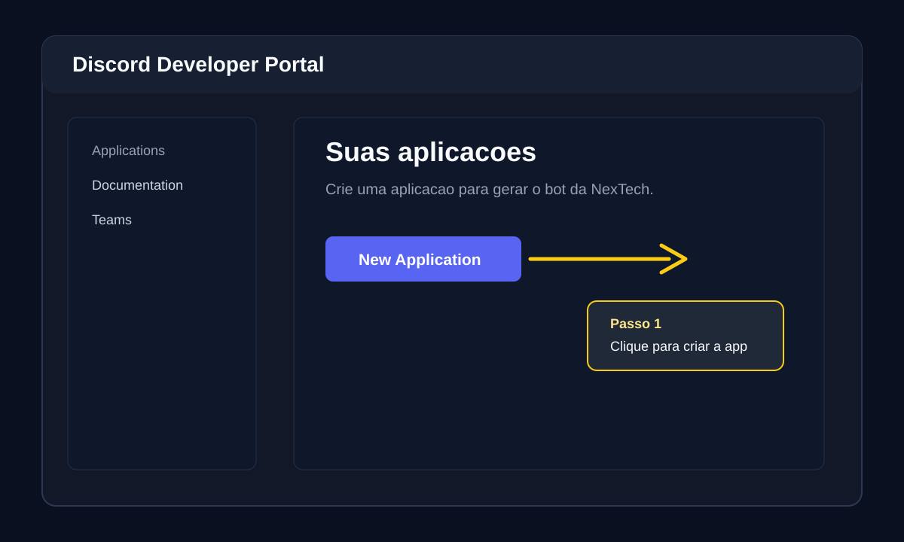
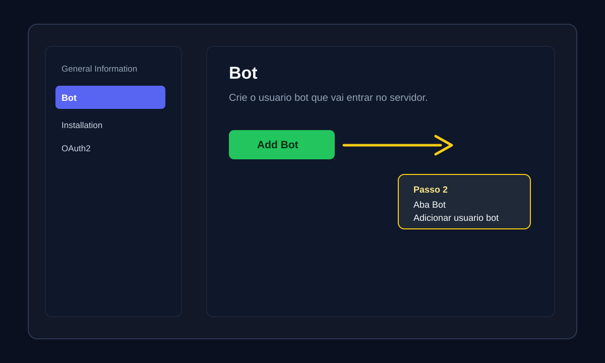
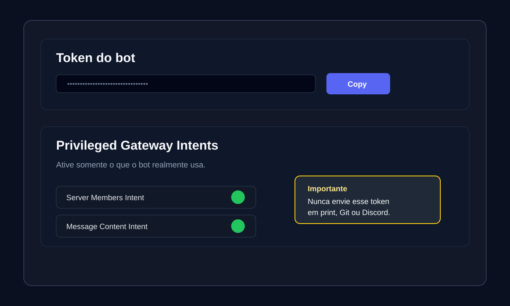
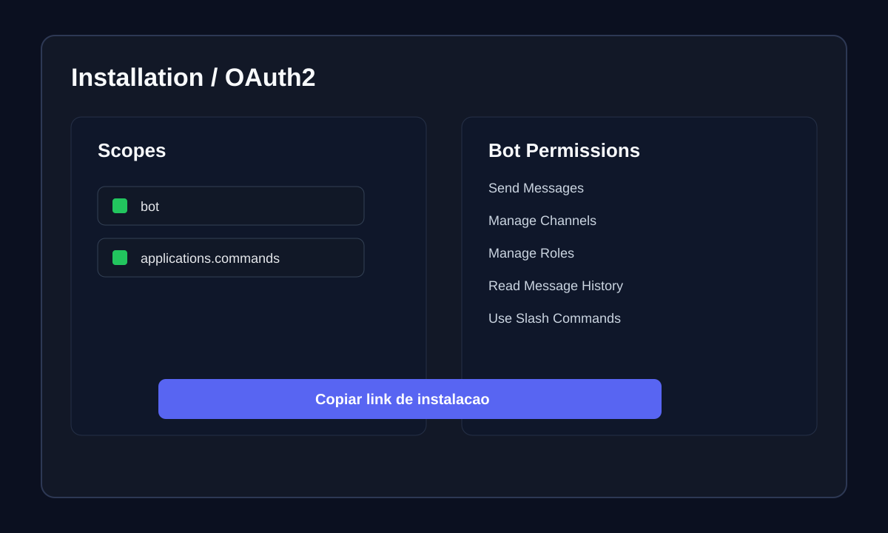
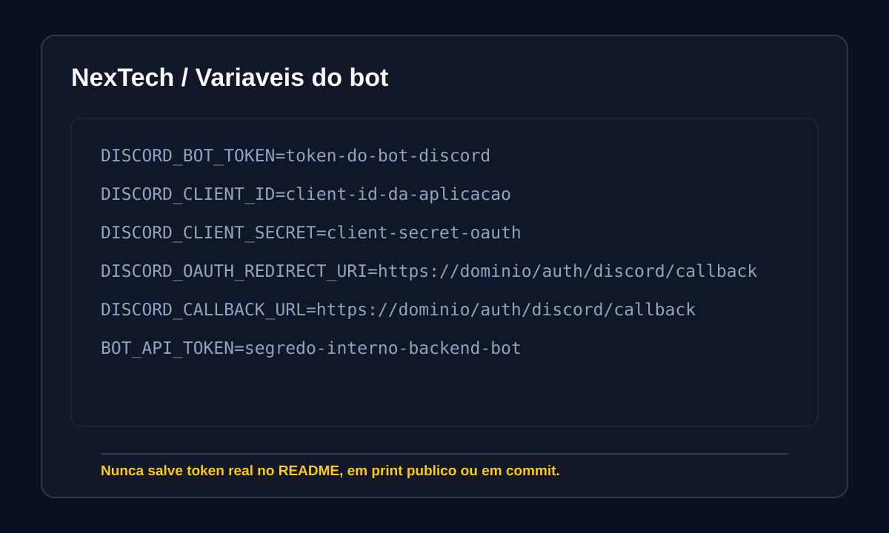

# Como criar um bot do Discord para a NexTech

Este guia mostra como criar uma aplicacao no Discord Developer Portal, gerar o token do bot, configurar intents, criar o link de convite e preencher as variaveis usadas pela NexTech.

As imagens abaixo sao ilustrativas para evitar expor tokens reais. A interface do Discord pode mudar, mas os nomes principais continuam sendo `Applications`, `Bot`, `Installation`, `OAuth2`, `Token`, `Scopes` e `Bot Permissions`.

Fontes oficiais:

- Discord Developer Portal: <https://discord.com/developers/applications>
- Discord Bots & Companion Apps: <https://docs.discord.com/developers/bots/overview>
- OAuth2 e permissoes: <https://docs.discord.com/developers/platform/oauth2-and-permissions>
- Getting Started oficial: <https://docs.discord.com/developers/quick-start/getting-started>

## 1. Criar a aplicacao

Acesse <https://discord.com/developers/applications>, entre com sua conta Discord e clique em **New Application**.



Depois:

1. Informe o nome do bot.
2. Aceite os termos do Discord.
3. Clique em **Create**.

Use um nome claro, por exemplo `NexTech`, `NexTech Suporte` ou o nome do cliente.

## 2. Criar o usuario bot

Dentro da aplicacao, abra a aba **Bot** e clique em **Add Bot** se o usuario bot ainda nao existir.



Configure o perfil:

- **Username**: nome que aparece no servidor.
- **Icon**: imagem do bot.
- **Public Bot**: deixe desativado se o bot for privado do cliente.
- **Requires OAuth2 Code Grant**: deixe desativado, exceto se houver um fluxo OAuth especifico que exija isso.

## 3. Copiar token e ativar intents

Na aba **Bot**, copie o token do bot. Esse valor vai para `DISCORD_BOT_TOKEN` na NexTech.



Ative apenas as intents que o bot realmente usa. Para a NexTech, normalmente sao necessarias:

- **Server Members Intent**: usada para membros, cargos, boas-vindas, verificacoes e permissoes.
- **Message Content Intent**: usada por modulos que leem conteudo de mensagens, logs, tickets e automacoes.

Seguranca obrigatoria:

- Nunca envie o token em print publico.
- Nunca cole o token no Git.
- Nunca coloque token real em `README.md`.
- Se o token vazar, clique em **Reset Token** no Developer Portal e atualize a variavel na hospedagem.

## 4. Criar link de convite

No portal atual, voce pode configurar a instalacao pela aba **Installation**. Em alguns fluxos, o link tambem aparece em **OAuth2** ou **OAuth2 > URL Generator**.



Para instalar o bot em servidor, use:

- Scope `bot`
- Scope `applications.commands`

Permissoes comuns para os modulos da NexTech:

- View Channels
- Send Messages
- Embed Links
- Attach Files
- Read Message History
- Manage Messages
- Manage Channels
- Manage Roles
- Use Slash Commands

Evite pedir **Administrator** sem necessidade. Se usar **Administrator** para setup inicial, remova depois e deixe somente as permissoes exigidas pelos modulos ativos.

Depois de gerar/copiar o link:

1. Abra o link no navegador.
2. Escolha o servidor.
3. Confirme as permissoes.
4. Clique em **Authorize**.

A conta que instala o bot precisa ter permissao **Manage Server** no servidor.

## 5. Configurar variaveis na NexTech

Pegue os valores no Discord Developer Portal:

- `DISCORD_BOT_TOKEN`: aba **Bot**, bot token.
- `DISCORD_CLIENT_ID`: aba **General Information**, Application ID.
- `DISCORD_CLIENT_SECRET`: aba **OAuth2**, Client Secret.
- `DISCORD_OAUTH_REDIRECT_URI`: URL de callback configurada no OAuth2.
- `DISCORD_CALLBACK_URL`: normalmente igual a `DISCORD_OAUTH_REDIRECT_URI`.



Exemplo sem valores reais:

```json
{
  "DISCORD_BOT_TOKEN": "token-do-bot-discord",
  "DISCORD_CLIENT_ID": "client-id-da-aplicacao",
  "DISCORD_CLIENT_SECRET": "client-secret-oauth",
  "DISCORD_OAUTH_REDIRECT_URI": "https://seu-dominio.example.com/auth/discord/callback",
  "DISCORD_CALLBACK_URL": "https://seu-dominio.example.com/auth/discord/callback",
  "BOT_API_TOKEN": "segredo-interno-entre-backend-e-bot"
}
```

Na Discloud, esses valores podem ficar em variaveis separadas ou dentro de `APP_CONFIG_JSON`/`APP_CONFIG_B64`, conforme documentado no `README.md`.

## 6. Registrar comandos e validar

Depois de configurar as variaveis:

```bash
npm run deploy:check
```

Em seguida, faca o deploy manual pela rotina oficial do projeto:

```bash
npm run release:discloud
```

Apos o deploy:

1. Confirme que o app esta online na Discloud.
2. Acesse `/health`.
3. Confira se o bot aparece online no Discord.
4. Teste um comando slash simples, como `/ping`, se estiver disponivel.
5. Teste o modulo desejado, por exemplo tickets, logs ou boas-vindas.

## Checklist rapido

- [ ] Aplicacao criada no Discord Developer Portal.
- [ ] Usuario bot criado na aba **Bot**.
- [ ] Token copiado para a hospedagem, sem commitar.
- [ ] Intents necessarias ativadas.
- [ ] Scopes `bot` e `applications.commands` configurados.
- [ ] Bot convidado para o servidor correto.
- [ ] Variaveis Discord configuradas na NexTech.
- [ ] `npm run deploy:check` aprovado.
- [ ] Deploy manual feito.
- [ ] Bot online e comandos testados.

